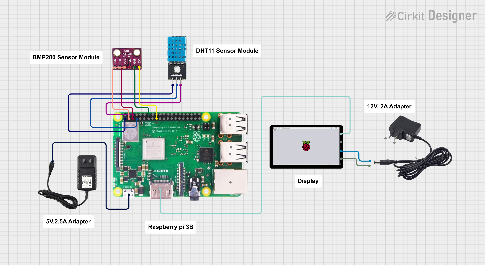
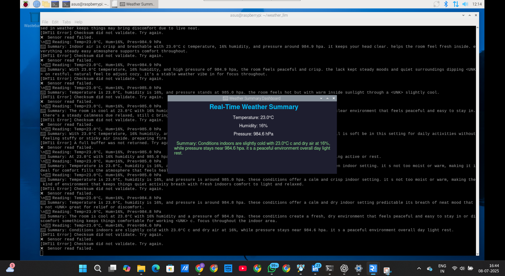

# LLM-Based Weather Summarizer on Raspberry Pi ☁️🍃

This project implements a lightweight transformer-based language model to summarize environmental sensor data (temperature, humidity, pressure) in natural language. Fully deployable on Raspberry Pi 3B.

## 🧠 Model Features
- Tiny Transformer LLM
- Trained on sensor data summaries
- Runs on Raspberry Pi
- On-device inference (edge AI)

## 📦 Directory Structure
- `models/`: Trained model weights
- `sensors/`: Arduino or external sensor interfacing scripts
- `transformer_model/`: Tiny Transformer architecture
- `train/`: Training and validation scripts
- `gui_display/`: GUI app for real-time summary
- `deployment/`: Raspberry Pi setup guide

## 📸 Preview

Here’s a quick look at the system:

### 🔌 Circuit Diagram


### 🖥️ Dashboard Screenshot



## 🚀 How to Run
```bash
pip install -r requirements.txt
python gui_display/WeatherDisplay.py
